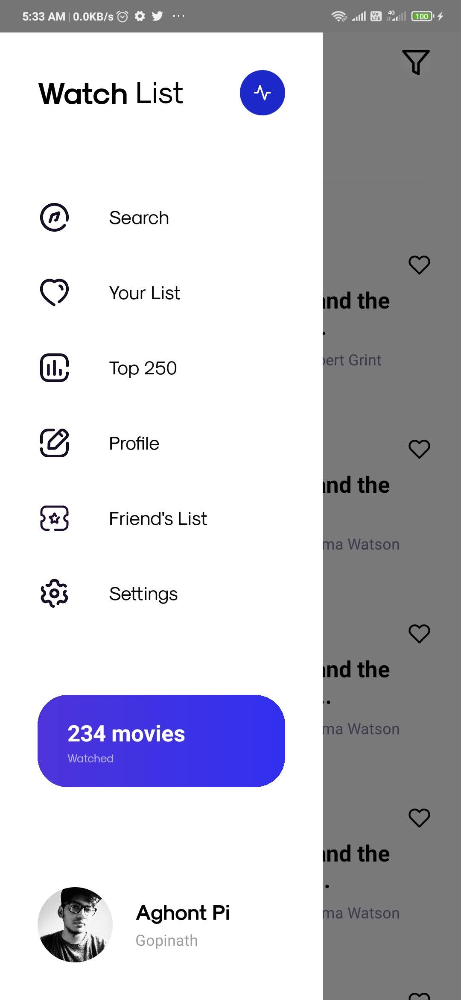
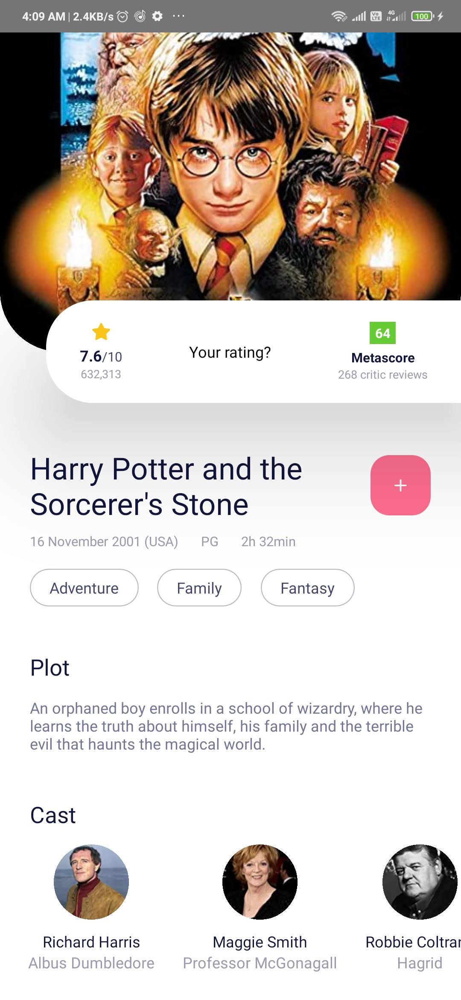
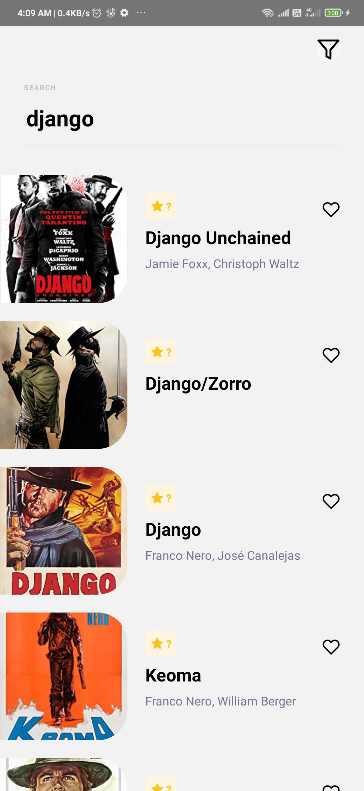

# WatchList

> ACTIVELY IN DEVELOPMENT

## What is this?

A react native application, thus userStories has not been posted, will make it public after a significant portion of work is completed.

## Overview

Api is built Inhouse, currently its source code is not made public

api - [https://api.bluepie.in](https://api.bluepie.in), is strictly for processing requests with external dependencies.

backend - [dev.bluepie.in](dev.bluepie.in), is database.

## Screens

Since this is in development, for final designs, build has to be taken.

  
  
  

## Built With

- react native plus libraries
- typescript
- backend is node with typescript
